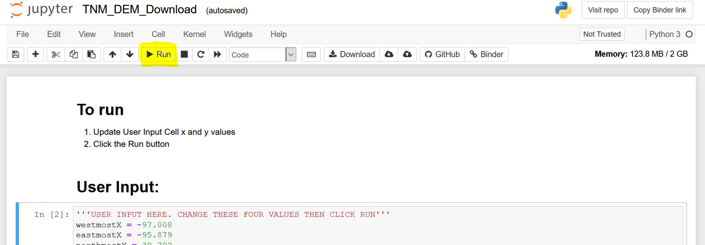

# The National Map Digital Elevation Model Download

Intended for a user to input their minimum bounding rectangle representing their study region and this script will print a list of urls to those DEM files for their study region. The user will need to click the link and download the file to the appropriate location.

The National Map Amazon s3 bucket:
http://prd-tnm.s3.amazonaws.com/index.html?prefix=StagedProducts/Elevation/1/TIFF/
An example of a tif url to download:
https://prd-tnm.s3.amazonaws.com/StagedProducts/Elevation/1/TIFF/n19w098/USGS_1_n19w098.tif

# HOW TO USE

This tool will generate urls to download DEM files based on a users's input bounding box . These urls may fail if the DEM does not exist, see the NOTES below.

> 

## Step One
Click on this 
 to open this jupyter notebook in your web browser. It may take a minute to load.

## Step Two
Once the jupyter notebook has loaded, you can modify the westmostX, eastmostX, northmostY, southmostY variables to match your bounding box. You can also modify the arcSecond values for the DEM resolution you require.
* The arcsecond will be '1' for 1 arc second and '13' for 1/3 arc second.
> 
>  

## Step Three
In the menu bar, click the Run button.

> 

## NOTES
Not every URL will have a corresponding DEM file to download, in those cases the link will display an xml file that contains a code of 'NoSuchKey'. This tends to happen when the bounding box is over an area where ther are no DEM's such as over the ocean.
