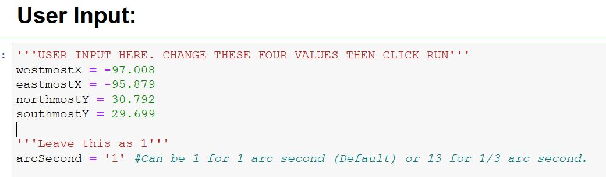

# The National Map Digital Elevation Model Download

Intended for a user to input their minimum bounding rectangle representing their study region and this script will print a list of urls to those DEM files for their study region. The user will need to click the link and download the file to the appropriate location.

The National Map Amazon s3 bucket:
http://prd-tnm.s3.amazonaws.com/index.html?prefix=StagedProducts/Elevation/1/TIFF/
An example of a tif url to download:
https://prd-tnm.s3.amazonaws.com/StagedProducts/Elevation/1/TIFF/n19w098/USGS_1_n19w098.tif

Click on this link to get started:

# HOW TO USE

This tool will generate urls to download DEM files based on a users's input bounding box . These urls may fail if the DEM does not exist, see the NOTES below.

## Step One
Modify the minX, minY, maxX, maxY to match your bounding box and the arcSecond values for the DEM resolution you require in the cells below.
* Westmost Longitude = minX
* Southmost Latitude = minY
* Eastmost Longitude = maxX
* Northmost Latitude = maxY
* The arcsecond will be '1' for 1 arc second and '13' for 1/3 arc second.

## Step Two
In the menu, open the 'Kernal' drop down and select 'Restart and Run All' then click 'Restart and Run All Cells'. This should run each cell and the DEM download links should appear at the bottom.

## NOTES
Not every URL will have a corresponding DEM file to download, in those cases the link will display an xml file that contains a code of 'NoSuchKey'. This tends to happen when the bounding box is over an area where ther are no DEM's such as over the ocean.
